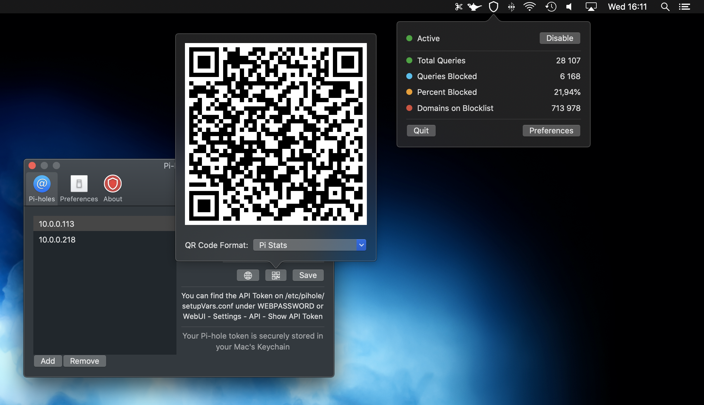
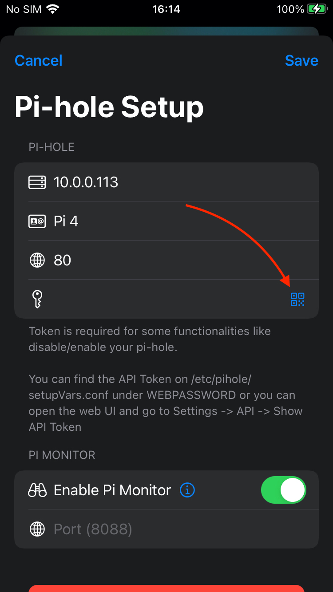

  

# Pi Stats Mobile

Follow up and manage the status of your [Pi-hole(s)](https://github.com/pi-hole/pi-hole) with this simple iOS app.

## Authentication Token
In order to use the "enable/disable" button you need to add your Authentication Token in the Settings screen.

There are two different ways to get your authentication token:

- /etc/pihole/setupVars.conf under WEBPASSWORD
- WebUI -> Settings -> API -> Show API Token (At this point you can also scan it using the QR Code scanner)

## Screenshots

  

## Exporting settings from macOS Pi Stats

If you use [Pi Stats for macOS](https://apps.apple.com/us/app/pi-stats/id1514075262?mt=12) you can export your Pi-holes using the QR Code feature.

Open Preferences and then click on the QR Code button for each Pi-hole you have.
Don't forget to change the QR Code Format to Pi Stats.

  

Then, on Pi Stats Mobile, when you tap to setup a new Pi-hole, just tap on the QR Code button and scan it.

  

## Requirement
This project uses SwiftUI and Widgets which requires iOS 14 or later.

Tested with Pi-hole 4.4 and 5.0

## Pi Monitor
If you want, you can install [Pi Monitor](https://github.com/Bunn/pi_monitor) on your Raspberry Pi to get extra information like temperature, uptime, memory usage and load average. Pi Monitor is experimental and not required to use Pi Stats, but it does make it more fun ;) 

## Download
Pi Stats Mobile ([SwiftHole](https://github.com/Bunn/SwiftHole) and [Pi Monitor](https://github.com/Bunn/pi_monitor)) is a open source hobby project of mine. Feel free to download the project and install on your device, but if you want to suport it's development you can buy it on the [App Store](https://apps.apple.com/us/app/id1523024268) :)
